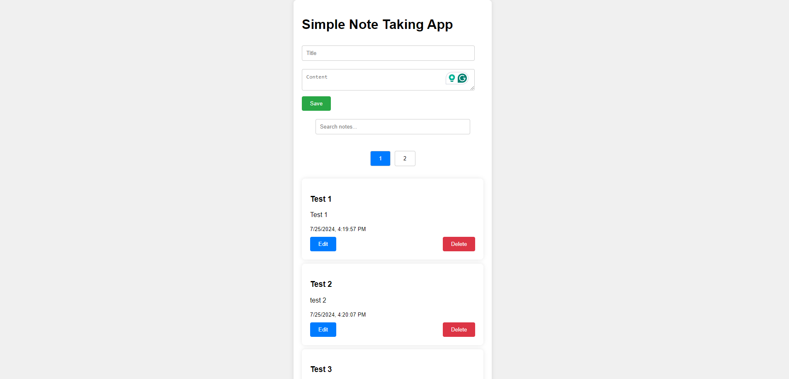
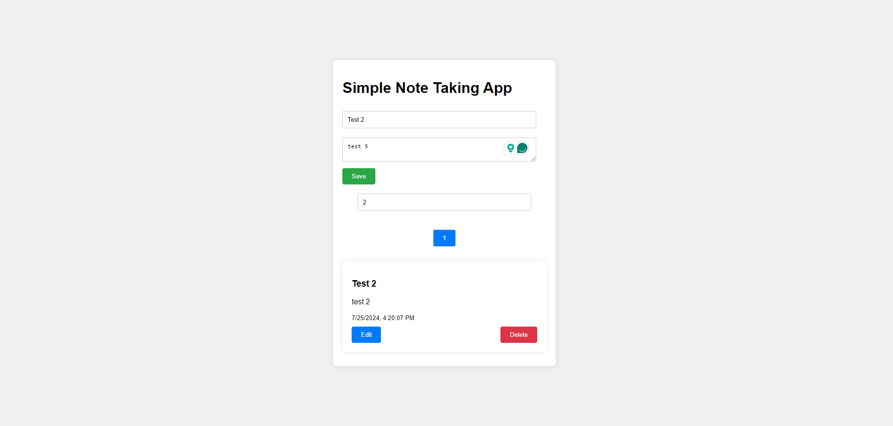
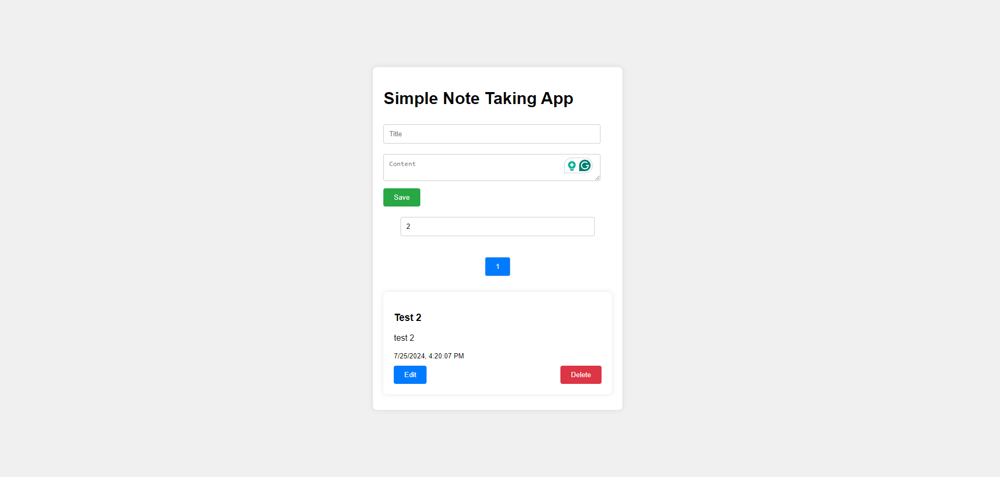
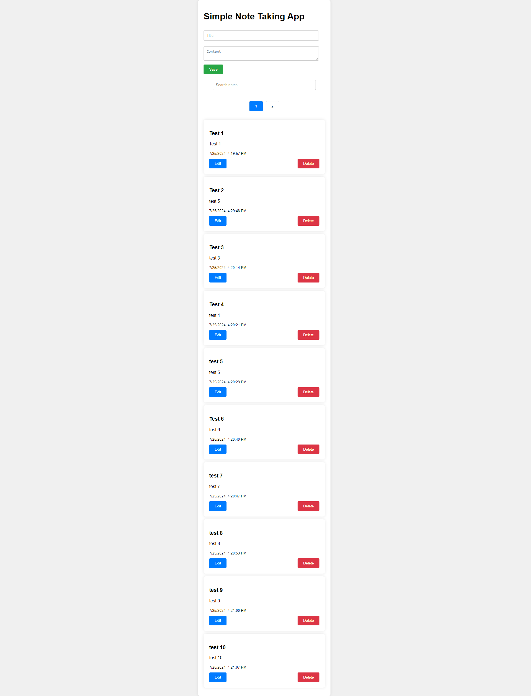
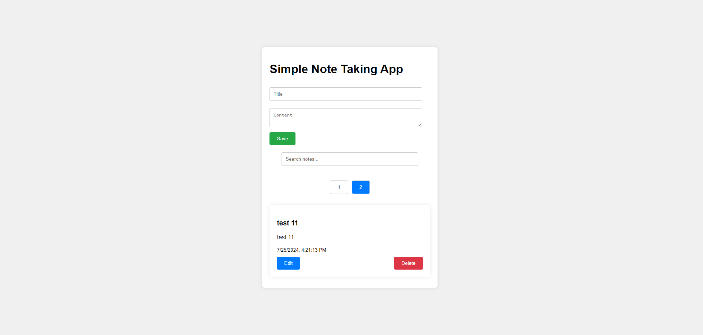

# Simple Note Taking App
A simplified web application for taking notes with local storage persistence.

[Deploy Link](https://main--simple-note-tracking-app.netlify.app/)

## Features
- Create, Read, Update, and Delete (CRUD) operations for notes.
- Pagination for viewing notes (10 notes per page).
- Search functionality to filter notes by title or content.
- Responsive design for usability across different devices.


## Screenshots

### Home Page


### Add/Edit Note


### Search Functionality


### Pagination




## Technologies Used
- React.js
- Local Storage API

## Setup and Installation
To run this project locally:
1. Clone the repository:
   ```bash
    git clone https://github.com/EshaanManchanda/Simple-Note-Tracking-App.git

    cd simple-note-taking-app

    npm install

    npm start

## Usage
- Create a new note using the form at the top.
- Edit or delete notes using the buttons on each note item.
- Use the search bar to filter notes by title or content.
- Navigate through notes using the pagination buttons.


## License
This project is licensed under the MIT License.

```bash
npm install gh-pages --save-dev


